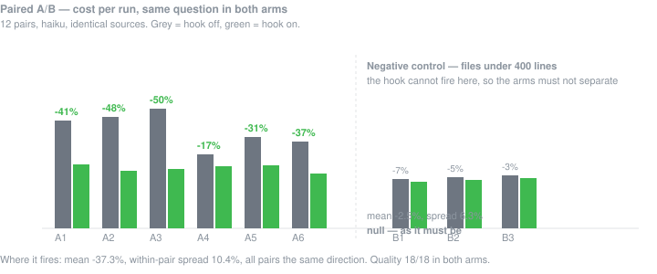
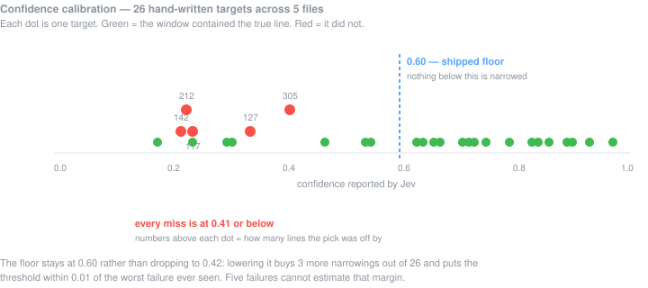

<div align="center">

# squint

**Claude reads the part of the file that answers your question, not the whole file.**

[](#what-this-does-not-tell-you)
[](#1-does-it-save-anything)
[](#2-does-it-hide-code)
[](#develop)
[](#install)
[](LICENSE)

</div>

---

A 1300-line file read to find one function puts all 1300 lines in the context — and
context is re-sent with every later turn, so you pay for it again and again.

This is a `PreToolUse` hook. It intercepts the read, asks a small fast model which chunk
actually answers what you asked, and **rewrites the tool's `offset` and `limit`** before
the file is opened.

```
you ask ──▶ Claude calls Read(report.ts) ──▶ [hook] ──▶ Read(report.ts, 781, 261)
                                               │
                                               └──▶ Jev: "which chunk answers this?"
                                                    c78 · confidence 0.93 · 1.5 s
```

Claude is then told exactly what happened, and how to undo it:

> squint narrowed this Read: report.ts is 1307 lines, showing 781-1041 (match at line
> 911, confidence 0.93). Read it again with an explicit offset or limit to see any other
> part — nothing was removed from the file.

---

## Why this works when telling the model to read less does not

This project is the salvage of a failed experiment.

The original attempt prepended a nine-line routing block to the prompt, naming the files
to look at and the ones to avoid. Preregistered A/B, repository frozen, control arm.
**The effect came out reversed**: the arm with the advice accumulated *more* context
(36,980 tokens against 34,024), and the noise was 1.5 to 3.4 times the effect.

The diagnosis is one sentence, and it is the reason this repository exists:

> **A suggestion is ignorable by construction. A rewritten `limit` is not.**

Advice asks the model to read less. This changes what the tool hands back. The saving
does not depend on the model cooperating, or on it noticing.

---

## Install

Needs **Node ≥ 20** and a [TypeSafe](https://docs.typesafe.ai) API key.

```bash
git clone https://github.com/valsecchi75/squint
cd squint
npm install
npm run install-hook
```

The key is read from the environment and from nowhere else:

```bash
export TYPESAFE_API_KEY=...          # bash / zsh
```
```cmd
set TYPESAFE_API_KEY=...             :: cmd
```

Install it into another project by pointing at that project's settings file:

```bash
node dist/src/install.js install --settings /path/to/project/.claude/settings.json
```

Remove it with `npm run uninstall-hook`. The uninstall is a command you can actually run,
not a paragraph in a README.

<details>
<summary><b>What the installer touches, and the one thing it gets wrong</b></summary>

<br>

It **merges, never rewrites**. Other hooks, permissions and keys are carried through
untouched; an uninstall removes only the entry it added; a `settings.json` it cannot parse
is left alone rather than overwritten.

**The limitation, reported rather than hidden.** The entry is added by re-serialising the
parsed file. Indentation and line endings are preserved, but an inline array or object
gets expanded onto several lines. The JSON is equivalent and nothing is lost — but a
hand-formatted `settings.json` will show unrelated lines as changed in a diff. When that
happens the installer says so:

```
squint · install · installed-reformatted · /path/.claude/settings.json
  note: the entry was added, but your settings.json was hand-formatted and has
  been re-printed. The JSON is equivalent and nothing was lost - but unrelated
  lines will show as changed in a diff. Check it before committing.
```

Preserving the original bytes exactly needs a textual graft. That is a beta item.

</details>

### Check it is working

```bash
SQUINT_DEBUG=1 claude -p "Read src/some-big-file.ts and name the function that ..."
```

With debug on, the hook prints one line per read — **including the reads it decided to
leave alone, and why**.

---

## The evidence

Everything below was measured on 2026-09-20, Claude Code `2.1.110`, model
`claude-haiku-4-5`. Raw data: [`docs/calibration.json`](docs/calibration.json). Method and
caveats: [`docs/evidence.md`](docs/evidence.md).

Two labels, never mixed. **ACTUAL** = read from a response or a log. **ESTIMATED** =
computed with a formula printed beside it. No percentage appears without its baseline.

### 1. Does it save anything?

A **paired** A/B: two working directories with byte-identical sources, differing only in
`.claude/settings.json`. The same question goes to both, and the pair is the unit of
analysis — so every question is its own control.



| population | pairs | mean delta | within-pair spread | verdict |
|---|---:|---:|---:|---|
| **Large files, hook fired** | 9 | **−37.3%** | 10.4% | separates, 3.6× the spread |
| Large files, hook did not fire | 3 | +1.0% | 12.3% | null |
| Large files, all together | 12 | −27.7% | 20.1% | separates, 1.4× |
| **Small files — negative control** | 6 | **−2.5%** | 6.3% | **null ✓** |

**Answer quality: 18 of 18 correct in both arms, every stratum.**

**The row that makes the rest believable is the last one.** Files under 400 lines cannot be
narrowed, so the arms must not separate there. They do not. Had they separated, the saving
on large files would not have been attributable to the narrowing.

**The row never to quote alone is the third.** `−27.7%` averages two populations that
behave in opposite ways and describes neither.

<details>
<summary><b>The bug this battery found, and the before/after</b></summary>

<br>

Of 12 eligible reads the hook fired on 9. The three misses were not prudent refusals — the
ledger recorded them as failed calls at **3006** and **3003 ms**: the timeout itself. One
success had landed at **2920 ms**, 80 ms short of failing.

A borrowed number was the cause. The narrowing request carries the file (~22,000 input
tokens); the small classification call it inherited its timeout from carries a compact
state (~8,000). One threshold over two distributions was discarding a quarter of the
narrowings.

| | timeout 3000 | timeout 6000 |
|---|---:|---:|
| fired, of eligible reads | 9/12 | **11/12** |
| aggregate delta | −27.7% (sd 20.1%) | **−33.8%** (sd 13.3%) |
| pairs in the same direction | no, two directions | **all twelve** |
| delta where it fired | −37.3% | −36.0% |
| timeouts | 2 | **0** |
| successful latencies | 1142–2920 ms | 1115–**1767** ms |

**A caveat that has to be stated.** The delta *where it fires* does not move. The fix does
not make the mechanism better, it makes it **more often available**. And the second
round's latencies are all under 1767 ms while the first had three above 1861 — a change in
the tail a timeout cannot produce. Part of the improvement is network or load conditions,
and with one round per condition it is not separable. What is established is narrower: a
3000 ms threshold **was being hit**, and is not any more.

</details>

### 2. Does it hide code?

This is the only metric that counts. Compression without recall is worthless, because a
window that drops the answer is a **silent omission** — the agent reads what it was handed
and never learns the rest existed.



26 targets — `(file, true line, goal)` — across five files of 508 to 1307 lines, with the
goals **written by hand from reading the code** and never asked of a model.

| confidence floor | narrows | recall | targets lost | coverage |
|---|---:|---:|---:|---:|
| 0.30 | 21/26 | 90% | 2 | 81% |
| 0.40 | 18/26 | 94% | 1 | 69% |
| 0.42 | 17/26 | **100%** | 0 | 65% |
| 0.50 | 16/26 | **100%** | 0 | 62% |
| **0.60 — shipped** | **14/26** | **100%** | **0** | 54% |
| 0.70 | 10/26 | 100% | 0 | 38% |

**All five failures scored 0.41 or below**, the worst off by 305 lines. The upstream
project's single observed failure was at **0.42** — two independent samples, same ceiling.

The floor stays at 0.60 rather than dropping to 0.42 because lowering it buys three
narrowings out of 26 and puts the threshold within 0.01 of the worst failure ever seen.
Five failures cannot estimate that margin.

**What the safety costs, plainly:** at 0.60 the hook refuses 12 of 26 targets, and **seven
of those would have produced a correct window**. Roughly half the available narrowings are
given up on purpose.

**One loss above the floor is on the record.** In an earlier round a window at confidence
**0.63** picked a line 133 off; recall survived only because the window was clamped to the
end of the file. Across ~40 observed narrowings, that is one. It is pinned in a test, so
whoever moves the threshold meets it first.

**Accuracy of the pick:** median error **8 lines**, minimum 0. The window is 150 lines or a
fifth of the file, centred on the pick, so it forgives about ±75.

### 3. What it costs, and what it is proportional to


| | value | label |
|---|---:|---|
| per narrowing | 21,932 input tokens · 1.5 s | ACTUAL |
| per narrowing, in money | $0.00092 | ESTIMATED |
| gross saving on a read it fires on | $0.0197 | ACTUAL |
| **share of the gain spent on the call** | **4.7%** | derived |

**On the repository this was built against, the size gate alone leaves out five files in
six** (40 eligible of 230). That ratio, not the −36%, is what a saving on a real working
day is proportional to.

---

## When it does nothing, which is often

The hook refuses far more often than it acts. That is the design, not a shortfall.

| it leaves the read alone when | why |
|---|---|
| the file is under **400 lines** | the call would cost more than the narrowing saves |
| the file is over **80,000 bytes** | it would need splitting, and confidences from different sections are not comparable — measured upstream, that path loses the target 3 times in 11 |
| the agent already set `offset` or `limit` | that is its own decision about this file, and overriding it would break the escape hatch too |
| the transcript yields no goal | there is nothing to narrow *towards* |
| confidence is under **0.60** | see [§2](#2-does-it-hide-code) |
| the path looks like `.env`, `secrets/`, `.git/` | it must never leave the machine |
| anything fails | no key, timeout, bad answer, unreadable file — the read proceeds as written |

Failure is always **fail-open**. The exit code is always 0 and `permissionDecision` is
never emitted: this narrows, it never blocks.

---

## What leaves your machine

Per narrowing, one request to `api.typesafe.ai` carrying:

- **the file's contents**, split into numbered chunks — this is the point, and the thing to
  weigh before pointing it at a private repository;
- **the last thing you typed**, truncated to 600 characters and scrubbed;
- **the file's path**, relative to the project root, never absolute.

Never sent: your key beyond the auth header, any file matching `.env` / `secrets/` /
`.git/`, any file you did not ask Claude to read.

**The scrub is a coarse net and its limit is stated, not hidden.** It removes common vendor
key prefixes, long opaque strings, and `key=value` pairs whose key looks like a credential.
**It will not catch a secret with no recognisable shape.** If your prompts routinely carry
such values, this hook is not for you.

The ledger stays local in `.squint/` and is gitignored.

---

## The ledger

Every read the hook **looked at** gets one JSONL line — narrowed or not.

```json
{"timestamp":"2026-09-20T15:04:11.482Z","sessionId":"...","path":"src/report.ts",
 "totalLines":1307,"narrowed":true,"offset":781,"limit":261,"pickedLine":911,
 "confidence":0.93,"exists":0.93,"linesAvoided":1046,"inputTokens":21935,"elapsedMs":1495}
```

The refusals are **the denominator**, and they are recorded for exactly that reason: a
ledger of successes only would report a 100% hit rate for a hook that fires on one file in
six.

`linesAvoided` counts **lines**, never converted to tokens. The hook knows what it stopped
from being read; it knows nothing about how those lines would tokenise. A measurement
multiplied by a guess is a guess.

---

## Configuration

Optional `.squint.json` in the project root. Every default is a measured value, and
[`docs/evidence.md`](docs/evidence.md) says what measured it.

```json
{
  "narrow": {
    "enabled": true,
    "minLines": 400,
    "maxBytes": 80000,
    "minConfidence": 0.60,
    "windowDivisor": 5,
    "minWindow": 150,
    "maxChunks": 200,
    "chunkLines": 10,
    "minGoalChars": 12,
    "timeoutMs": 6000
  },
  "jev": { "model": "jev-latest", "host": "api.typesafe.ai" }
}
```

A missing, unreadable or malformed file is not an error: the affected fields fall back to
these defaults.

---

## What this does not tell you

- **In a free-form task, the agent often does not call `Read` at all.** Tried on two
  open-ended multi-file questions, one run delegated the whole job to a subagent and
  another invoked a skill; neither produced a single narrowing. **That test was
  inconclusive and is reported as inconclusive.** Everything measured above is the case
  where Claude reads a named large file. How much of a real day that is, is not known.
- **One model.** All of it ran on `claude-haiku-4-5`. The mechanism is model-independent in
  principle — it changes what the tool returns, not what the model decides — but the size
  of the effect is not.
- **One kind of task.** "Find a function in a large file" is the case this is built for.
  Reads that skim rather than seek are not represented.
- **Small n.** Twelve pairs in the A/B, 26 targets in the calibration. The paired design is
  what lets that separate signal from noise; it is not enough to characterise a tail.
- **One repository.** The one-file-in-six eligibility rate is a property of that codebase.
- **Windows-first.** Developed and measured on Windows 11, Node 24. Nothing in it is
  platform-specific, and nothing in it has been measured elsewhere.

---

## Develop

```bash
npm run typecheck     # tsc --noEmit
npm test              # build, then node --test  (27 tests)
npm run build
```

`src/policy.ts` is pure: it imports types and nothing else, and a test asserts that against
the file's own source. A policy that reads a file to decide whether to spend a call has
already spent something.

```
src/policy.ts     the refusal ladder, chunking, window — no I/O
src/hook.ts       stdin → decision → updatedInput, fail-open throughout
src/jev.ts        one call, raced against its own budget
src/ledger.ts     JSONL, path shortening, the scrub
src/config.ts     .squint.json, fail-open
src/install.ts    merge into .claude/settings.json, and back out
```

---

## Credits

The policy, its six refusal conditions and its thresholds are a port of the Read hook of
**[BorisLeMeec/jev](https://github.com/BorisLeMeec/jev)** (MIT), whose author measured them
first and documented the reasoning behind each one. This repository contributes an
independent TypeScript implementation, the ledger, the installer, and a fresh calibration
of the confidence floor on a different codebase.

Decisions come from [Jev](https://docs.typesafe.ai), TypeSafe's System One model.

MIT — see [LICENSE](LICENSE).
